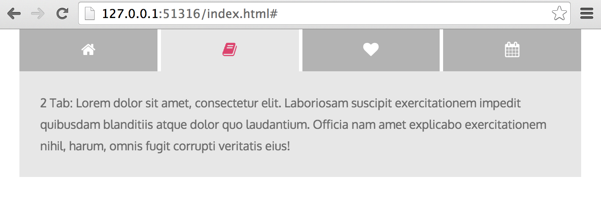

- SCSS is used
- if JS is turned off it gracefully degrades and shows all the content

The result: http://alexkval.github.io/responsive-tabs/

It looks like:

On the small screens:

And with JS disabled it gracefully degrages to:

